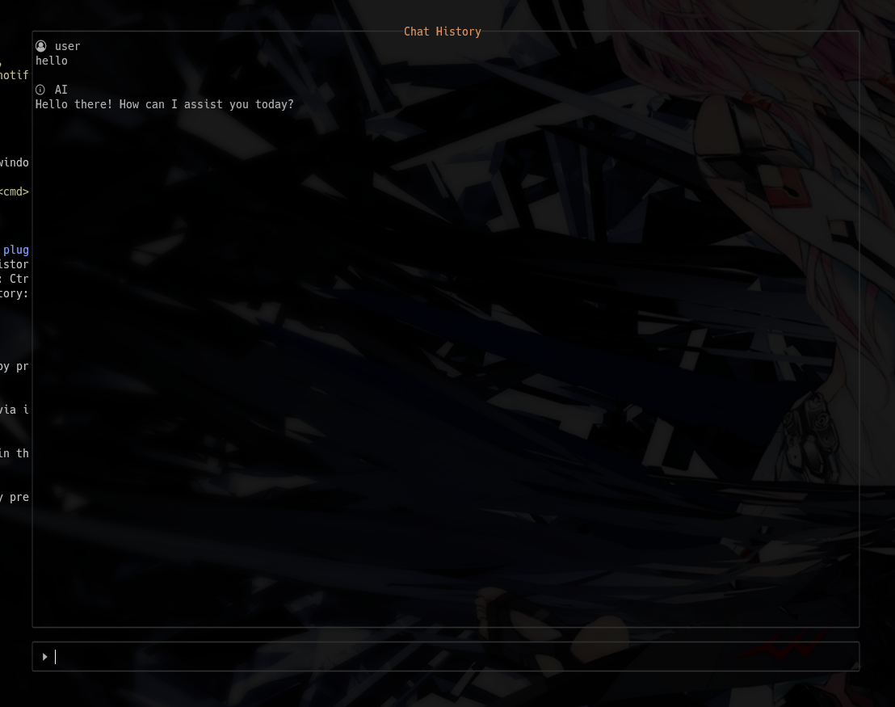
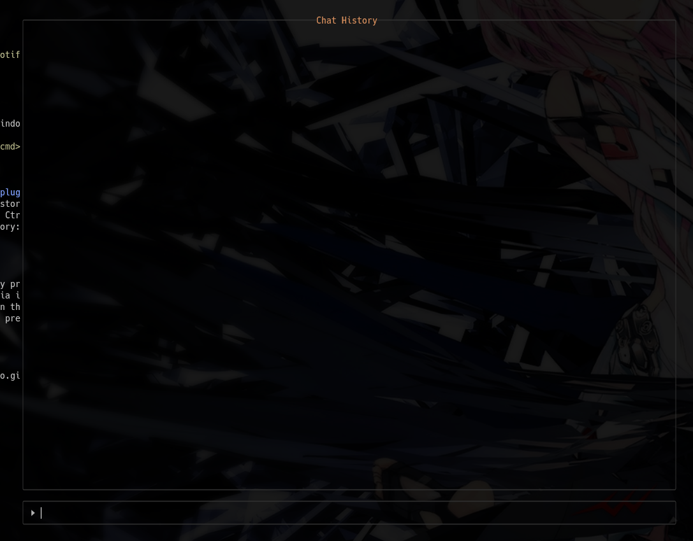
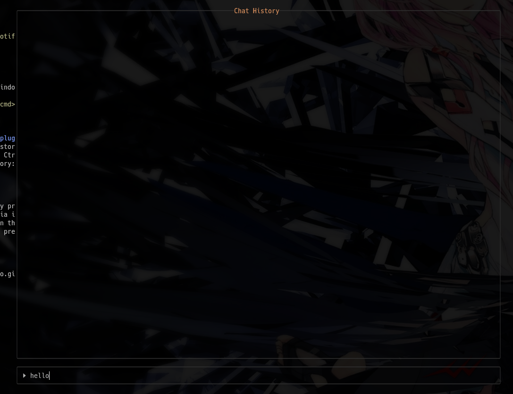
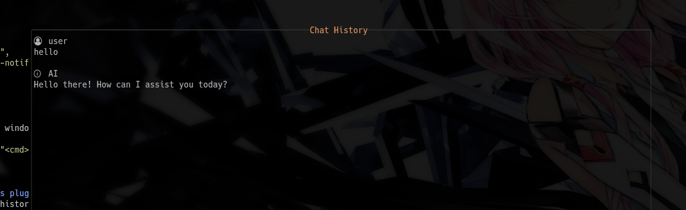
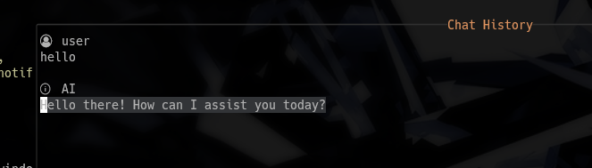

# ai-assistant.nvim
This is a Neovim plugin that allows ChatGPT to be used from within the editor.



## Features
- Receive and display ChatGPT's responses in a dedicated chat history buffer.
- Chat history buffer allows you to review past conversations.
- Asynchronous communication with ChatGPT, not blocking your editing experience.


## Requirements
- Neovim nightly
- [rcarriga/nvim-notify](https://github.com/rcarriga/nvim-notify)


## Install
### lazy.nvim
```
{
  "IwasakiYuuki/ai-assistant.nvim",
  dependencies = { "rcarriga/nvim-notify" },
}
```


## Config
Press `<leader>c`, open / close a window to interact with ChatGPT.
```lua
vim.keymap.set('n', '<leader>c', "<cmd>AIAssistantToggle<cr>")
```


## Local Keymap (avaliable in this plugin's windows)
- (normal/insert) Move into chat history: Ctrl-o
- (normal/insert) Move into prompt: Ctrl-i
- (normal/insert) Refresh chat history: Ctrl-r
- (insert) Abort request: Ctrl-c


## Usage
1. Open the chat interface window by pressing `<leader>c` or running the `:AIAssistantToggle` command.


2. Inpute your message to ChatGPT via input prompt, and press enter to send request.


3. ChatGPT's response will appear in the chat history window.


4. Move into chat history window by pressing `Ctrl-o`, copy the ChatGPT's response.

